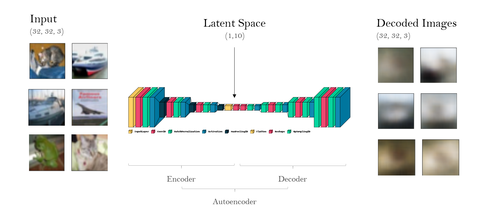

# Autoencoder for Image Retrieval

*Contributors: Maximilian Lindinger & Julian Schelb*



## File Structure

The code of this project is divided into several jupyter notebooks loosely corresponding to the assignments sections:

##### Feature Encoding:

* *3_1_Feature_Encoding_Dataset_Preparation.ipynb:*
  Importing, Splitting, Exploring and Normalizing the Image Data
* *3_2_Feature_Encoding_Build_Autoencoder.ipynb:* 
  Experimenting with different Network Architectures
* *3_3_Feature_Encoding_Train_Autoencoder.ipynb:* 
  Training using the final Network Architecture

##### Sanity Check & Data Querying:

* *4_Sanity_Check.ipynb:* 
  Analysing the performance of the model by comparing the original and the decoded image as well as the extracted features using a scatter plot matrix and Umap projection  
* *5_Data_Querying.ipynb:* 
  Usage of the trained model to find the most similar images

##### Bonus:

* *6_1_2_Bonus_Retraining.ipynb:* 
  Further optimization the the model by training the model with rotated and noisy data
* *6_3_Bonus_Querying_Modified_Data:* 
  Evaluation of the optimized model 


## Requirements

To install the required python packages please use the following command:

```console
pip install -r requirements.txt 
```